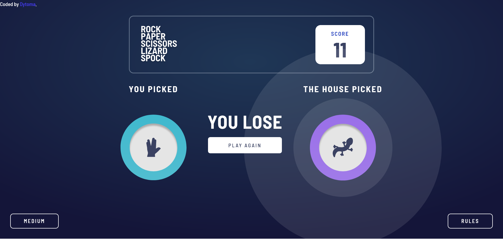

# Frontend Mentor - Rock, Paper, Scissors solution

This is a solution to the [Rock, Paper, Scissors challenge on Frontend Mentor](https://www.frontendmentor.io/challenges/rock-paper-scissors-game-pTgwgvgH). Frontend Mentor challenges help you improve your coding skills by building realistic projects. 

## Table of contents

- [Overview](#overview)
  - [The challenge](#the-challenge)
  - [Screenshot](#screenshot)
  - [Links](#links)
- [My process](#my-process)
  - [Built with](#built-with)
- [Author](#author)
- [Acknowledgments](#acknowledgments)


## Overview

  This is my solution to the paper, rock, scissors game and I'm quite happy with the result and will be improving it.
### The challenge

Users should be able to:

- View the optimal layout for the game depending on their device's screen size
- Play Rock, Paper, Scissors against the computer
- Maintain the state of the score after refreshing the browser _(optional)_
- **Bonus**: Play Rock, Paper, Scissors, Lizard, Spock against the computer _(optional)_

### Screenshot





These are screenshot of some of the features of the website. You can view it all on live at [Rock-Paper-Scissors-Gme]

### Links

- Solution URL: [Solution URL here](https://www.frontendmentor.io/challenges/rock-paper-scissors-game-pTgwgvgH/hub)
- Live Site URL: [Live site URL here](https://rock-paper-scissors-two-gold.vercel.app/)

## My process

I use Vite with react and it was pretty fun building this project, I learned a lot and Vite is a powerful tool when it comes to fast deployment and so on.

### Built with

- Semantic HTML5 markup
- CSS custom properties
- Flexbox
- CSS Grid
- Mobile-first workflow
- [Vite](https://vitejs.dev/guide/) - JS library
- [React reveal](https://www.react-reveal.com/) - React library


### What I learned

I learned about the onLoad event.

```jsx
<div onLoad={() => { game();}}></div>
```


## Author

- Frontend Mentor - [@Dytoma](https://www.frontendmentor.io/profile/Dytoma)
- Twitter - [@OmarDytoma](https://www.twitter.com/OmarDytoma)
